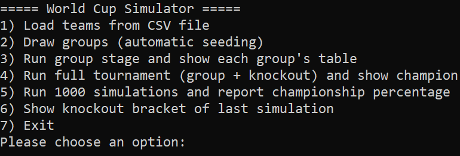
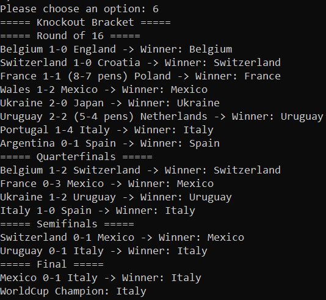
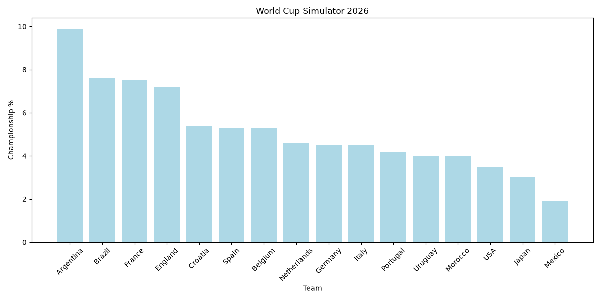

# World Cup 2026 Simulator | شبیه‌ساز جام جهانی ۲۰۲۶

Object-oriented simulation of the FIFA World Cup 2026 (32 teams) using the Poisson distribution.

شبیه‌سازی شی‌گرای جام جهانی ۲۰۲۶ (۳۲ تیم) با استفاده از توزیع پواسون.

**Author / نویسنده :** Marzie Azizi (مرضیه عزیزی) — 403131063

---

## English

### Features
- Reads 32 teams from a CSV file.
- Group draw based on FIFA ranking seeding.
- Simulates group stage + knockout stages (Round of 16 → Final).
- Poisson-based goals, extra time, and penalty shootouts.
- Runs 1000 simulations and reports each team's championship %.
- Text bracket + `matplotlib` bar chart.

### Run
```bash
pip install numpy matplotlib
python main.py
```
Keep `worldcup_2026_teams.csv` in the same folder.

### Menu
1. Load teams  
2. Draw groups  
3. Group stage  
4. Full tournament
5. 1000 simulations  
6. Knockout bracket  
7. Exit

---

## فارسی

### امکانات
- خواندن ۳۲ تیم از فایل CSV.
- قرعه‌کشی گروه‌ها بر اساس سیدبندی رنکینگ فیفا.
- شبیه‌سازی مرحله گروهی + مراحل حذفی (یک‌هشتم تا فینال).
- گل با توزیع پواسون، وقت اضافه و ضربات پنالتی.
- اجرای ۱۰۰۰ شبیه‌سازی و گزارش درصد قهرمانی هر تیم.
- براکت متنی + نمودار میله‌ای با `matplotlib`.

### اجرا
```bash
pip install numpy matplotlib
python main.py
```
فایل `worldcup_2026_teams.csv` باید در همان پوشه باشد.

### منو
۱. بارگذاری تیم‌ها  
۲. قرعه‌کشی گروه‌ها  
۳. مرحله گروهی  
۴. اجرای کامل جام
۵. شبیه‌سازی ۱۰۰۰باره  
۶. براکت حذفی  
۷. خروج

---

## Images | تصاویر

تصویر 1 — منوی اصلی

تصویر 2 — براکت کامل مراحل حذفی

تصویر 3 — نمودار میله ای درصد قهرمان 1۶ تیم برتر
